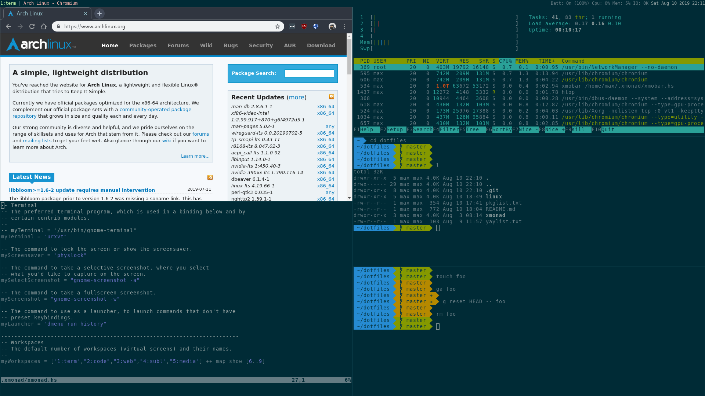

# Max dotfiles
This is a collection of configs for my archlinux setup.
I use a solarized theme with xmonad, oh-my-zsh and urxvt.



## Packages
```
pacman -S --needed - < pkglist.txt
```

## Oh my zsh
```
sh -c "$(curl -fsSL https://raw.githubusercontent.com/robbyrussell/oh-my-zsh/master/tools/install.sh)"
```

## yay for AUR
```
git clone https://aur.archlinux.org/yay.git
cd yay
makepkg -si
cd .. && rm -rf yay
```

# AUR packages
```
yay --needed -S - < yaylist.txt
```

## German keyboard
```
localectl --no-convert set-x11-keymap de pc105 nodeadkeys
```

## AWS profile changer
```
# GPG not supported
sudo npm install -g awsp
# GPG supported
sudo pip install git+https://github.com/naftulikay/aws-env@v1.1.0
```

## Enable pcscd.service for smartcards
```
systemctl enable pcscd.service
systemctl start  pcscd.service
```

## Default screenshot location
```
mkdir $HOME/screenshots
dconf write /org/gnome/gnome-screenshot/auto-save-directory "'file://$HOME/screenshots'"
```

## Optional
```
xbindkeys
synclient TouchpadOff=1
```
